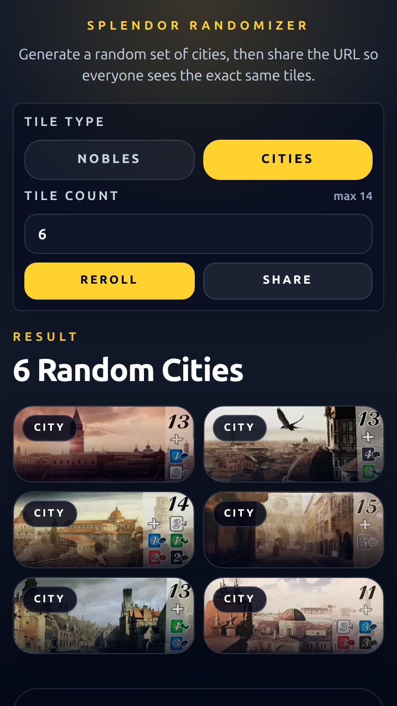
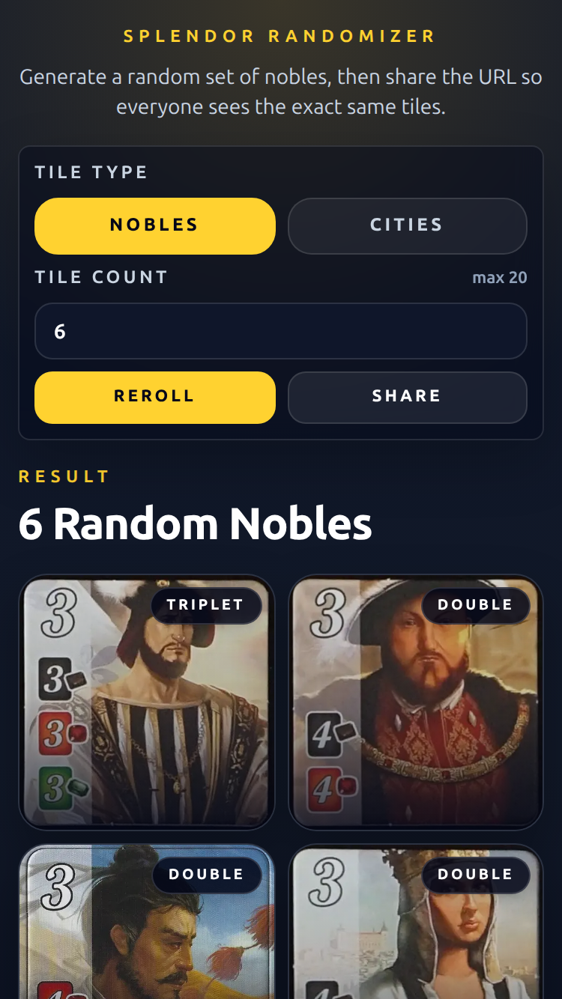

# Splendor Randomizer

Randomizes noble and cities cards for splendor

## Deployments

- Master branch is for the source code that's hosted on
  [GhPages](https://deniszholob.github.io/splendor-randomizer/)

# Support Me

If you find the cheat sheet or the source code useful, consider:

- Donating Ko-fi: https://ko-fi.com/deniszholob
- Supporting on Patreon: https://www.patreon.com/deniszholob

# Screenshots

# Credits:

Images from https://boardgamegeek.com/
Splendor board game: https://boardgamegeek.com/boardgame/148228/splendor
